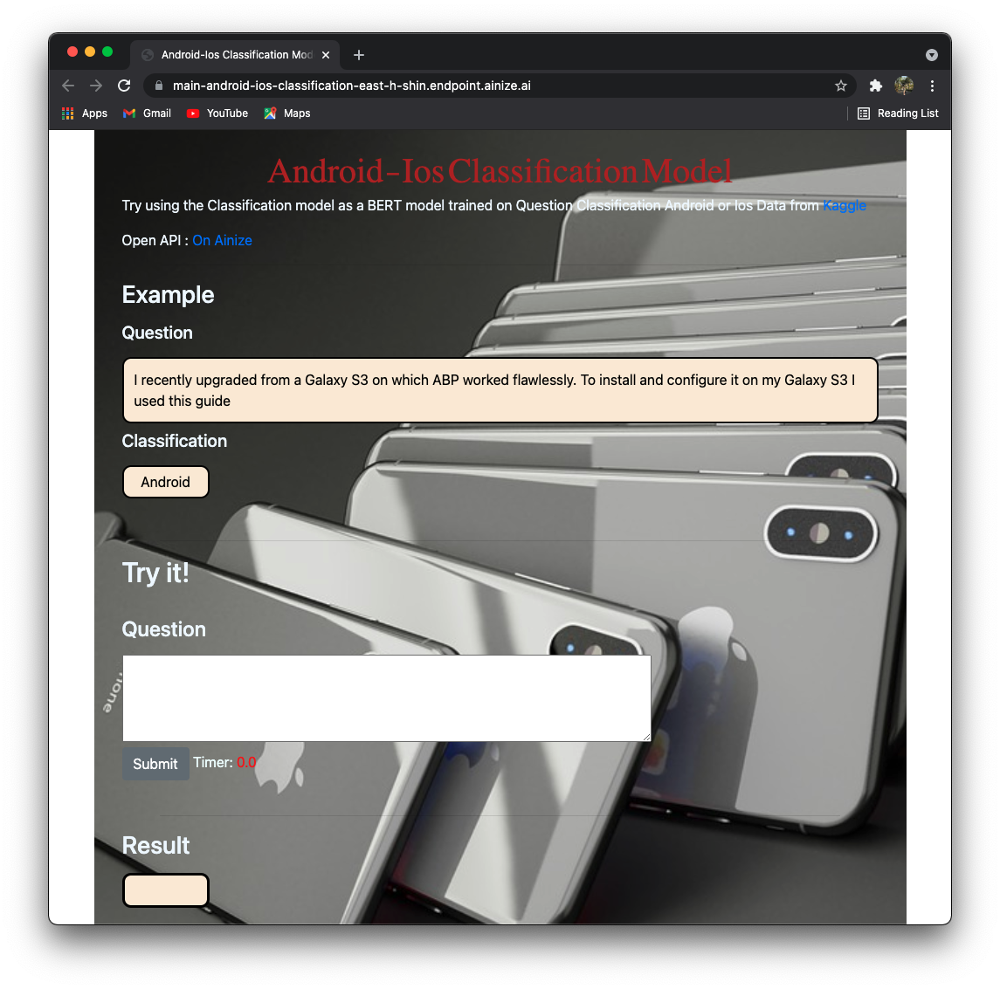
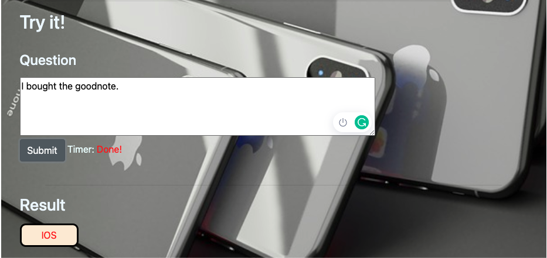

# Android-Ios Question Classification

---

## Overview

---
The Android-Ios Question Classification model takes questions as input.
It's a model that classify whether the question is about Android or Ios.

Github : [Github](https://github.com/EastHShin/Android-Ios-Classification)
<br>
Ainize : [Ainize](https://ainize.ai/EastHShin/Android-Ios-Classification?branch=main)
<br>
Huggingface : [Huggingface](https://huggingface.co/EasthShin/Android_Ios_Classification)
<br>
Model Code : [Workspace](https://ainize.ai/workspace/create?imageId=hnj95592adzr02xPTqss&git=https://github.com/EastHShin/Android-Ios-Classification-Workspace)
<br>
<br>

### Demo

<br>

## How to make

---
1. Get the Question classification Android-Ios dataset from [Kaggle](https://www.kaggle.com/xhlulu/question-classification-android-or-ios)
2. Pre-process the dataset
3. Fine-tune the bert-base-cased model. If you know the Fine-tuning process, go to [Workspace](https://ainize.ai/workspace/create?imageId=hnj95592adzr02xPTqss&git=https://github.com/EastHShin/Android-Ios-Classification-Workspace)
## How to run a Demo

---

Endpoint : https://main-android-ios-classification-east-h-shin.endpoint.ainize.ai

## With CLI

---

### Post Parameter
```
question = "question about Smartphone"
```

### Input format
```
    {
        "question" : "string"
    }
```

### Output format
```
    {
        0: {'label': 'LABEL_0', 'score': score}
    }
```

### API Prediction Test

```
$ curl -X POST "https://main-android-ios-classification-east-h-shin.endpoint.ainize.ai/classification" -H "accept: application/json" -H "Content-Type: multipart/form-data" -F "question={I bought the GoodNote}"

{
    0: {'label': 'LABEL_1', 'score': 0.9959855079650879}
}
```

### Healthy Check

```
$ curl --request GET 'https://main-android-ios-classification-east-h-shin.endpoint.ainize.ai/healthz'

{
  Health
}
```
